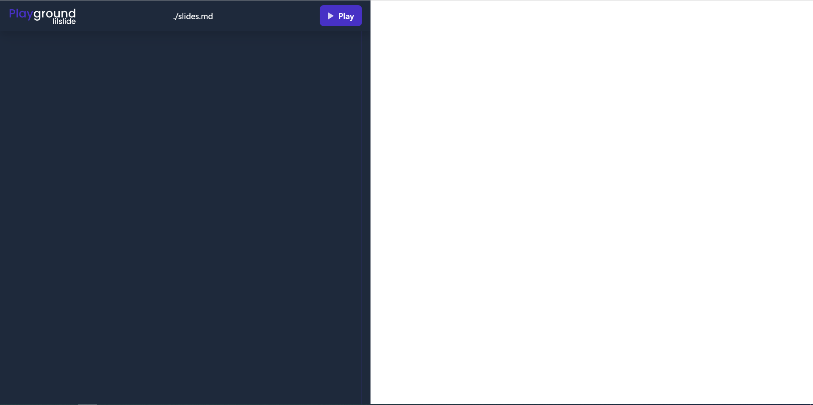

# Welcome to lilslide

This a web application to create slide using the power of markdown and some custom function that I made

Tasks that's already implemented and needs to be implemented

- [x] Integrate the md editor and the preview (with full screen slide)
- [x] Add styling to the slide using the front matter attributes
- [x] Create new page [issue-1](https://github.com/judicaelandria/lilslide/issues/1)
- [ ] Control slide using keyboard arrow left and right
- [x] Add syntax highlighter
- [ ] Add interval and make the slide to go next after a giving time

I'll add some new things here, but for now this is the feature we should integrate.
**If you have some idea please create a new issue so we can add it to the list too :)**

## Styling the slide

You can add style to your slide, you just need to add the style like this

\---

### your style

\---

### Supported style

- **_backgroundImage_** : to add background image (you need to provide a link to your image)
- **_backgroundColor_** : to add background color (only support rgb color for now, support for hex and hsl will be added), and use linear-gradient
- **_color_** : for the text color
- **_justifyContent_**
- **_alignItems_**
